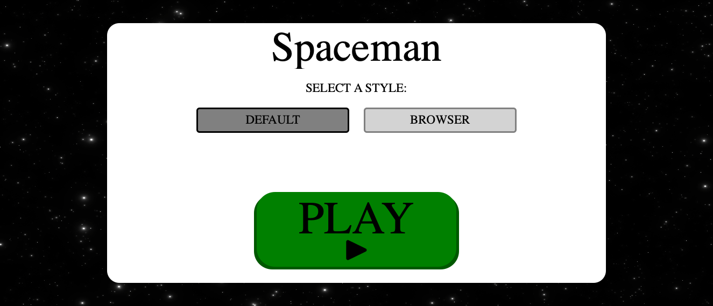

# Spaceman
A browser-based, guessing game. Relies on an user guessing the mystery word or phrase with a given number of errors.

# Screenshot(s)

# Technologies Used
- 
- 
- 
- 
- 

# Getting Started

## [Click to Play Spaceman!](https://tbartoccidev.github.io/spaceman/)

# Next Steps
- Add more/smoother animation using libraries
- Make text adjustable with outside libraries
- Use media queries to better handle screen size